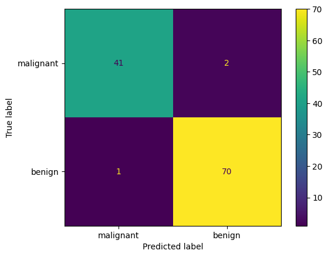

# Machine-Learning-Notes

This repository documents my machine learning study journey (mainly following MIT 6.036), including notes and practice projects.

---

## Repository Structure

```
Machine-Learning-Notes
│
├── perceptron-from-scratch
├── logistic-regression-breast-cancer
│
└── README.md
```

Each algorithm will be implemented as an independent mini-project.

---

## Implemented Projects

### <u>1. Perceptron From Scratch</u>

Implementation of the **Perceptron algorithm** using Python and Numpy.

Features:

* binary linear classifier implementation
* synthetic dataset generation
* decision boundary visualization
* training process animation

Example decision boundary:


Training process visualization:


More details:

$\to$ **[Perceptron Project](perceptron-from-scratch)**

### <u>2. Logistic Regression - Breast Cancer Classification</u>

Implementation of a **Logistic Regression model** using Python and scikit-learn on the Breast Cancer Wisconsin dataset.

Features:

* binary classification (malignant vs benign tumors)
* train/test split with proper evaluation pipeline
* feature standardization using StandardScaler
* model evaluation (accuracy, confusion matrix, precision, recall, F1-score)
* probability prediction using sigmoid (predict_proba)
* feature importance analysis via model coefficients
* visualization of confusion matrix and feature importance

Example confusion matrix:



More details:

$\to$ **[Logistic Regression Project](logistic-regression-breast-cancer)**


---

## Tools

- Python
- VS code
- Git & GitHub

---

## Motivation

I created this repository to:

- Strengthen my understanding of mahcine learning fundamentals
- Build a solid fundation in ML algorithms
- document my progress in public

This is an ongoing project and will continue to evolve.

---

## Author

Rick Lee

GitHub: **NefelibataEpi**