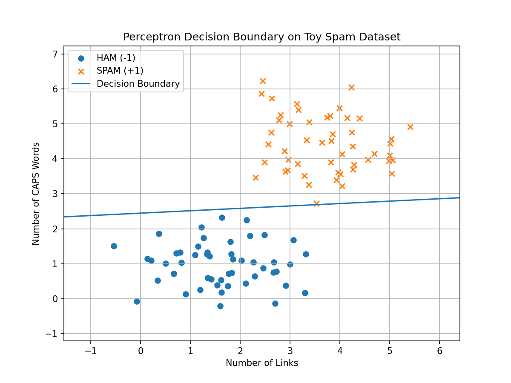
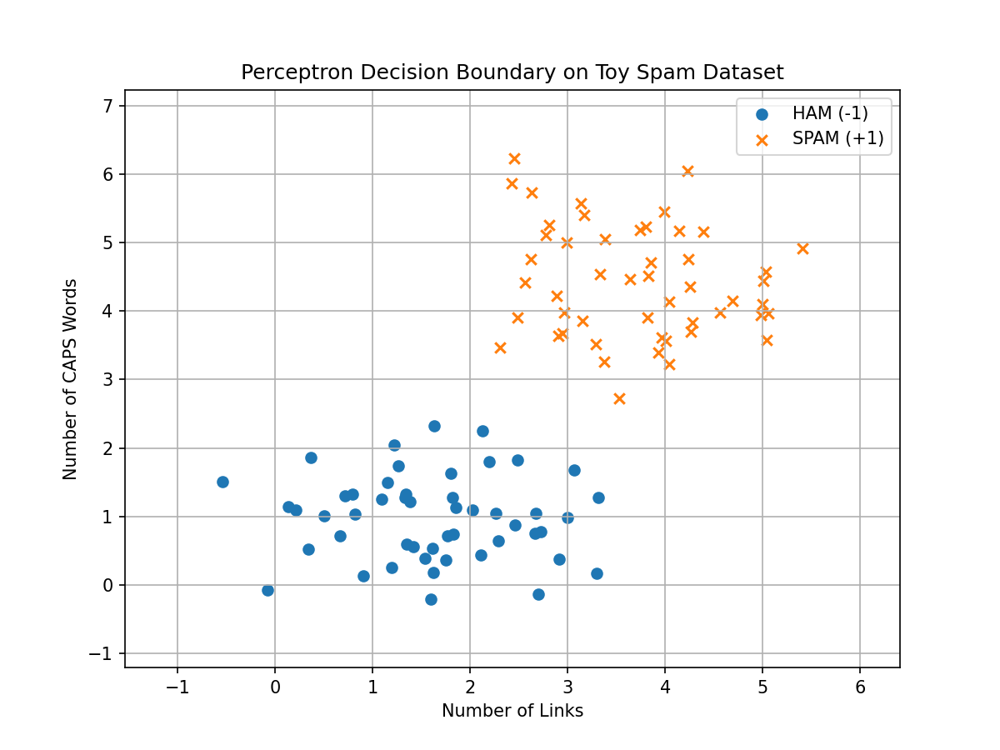

# Machine-Learning-Notes

This repository documents my machine learning study journey (mainly following MIT 6.036), including notes and practice projects.

---

## Repository Structure

```
Machine-Learning-Notes
│
├── perceptron-from-scratch
│   ├── src
│   ├── results
│   ├── train.py
│   └── README.md
│
└── README.md
```

Each algorithm will be implemented as an independent mini-project.

---

## Implemented Projects

### <u>1. Perceptron From Scratch</u>

Implementation of the **Perceptron algorithm** using Python and Numpy.

Features:

- binary linear classifier implementation
- synthetic dataset generation
- decision boundary visualization
- training process animation

Example decision boundary:



Training process visualization:



More details:

$\to$ **[Perceptron Project](perceptron-from-scratch)**

---

## Tools

- Python
	- Numpy
	- Matplotlib
	- Imageio
- VS code
- Git & GitHub

---

## Motivation

I created this repository to:

- Strengthen my understanding of mahcine learning fundamentals
- Build a solid fundation in ML algorithms
- document my progress in public

This is an ongoing project and will continue to evolve.

---

## Author

Rick Lee

GitHub: **NefelibataEpi**